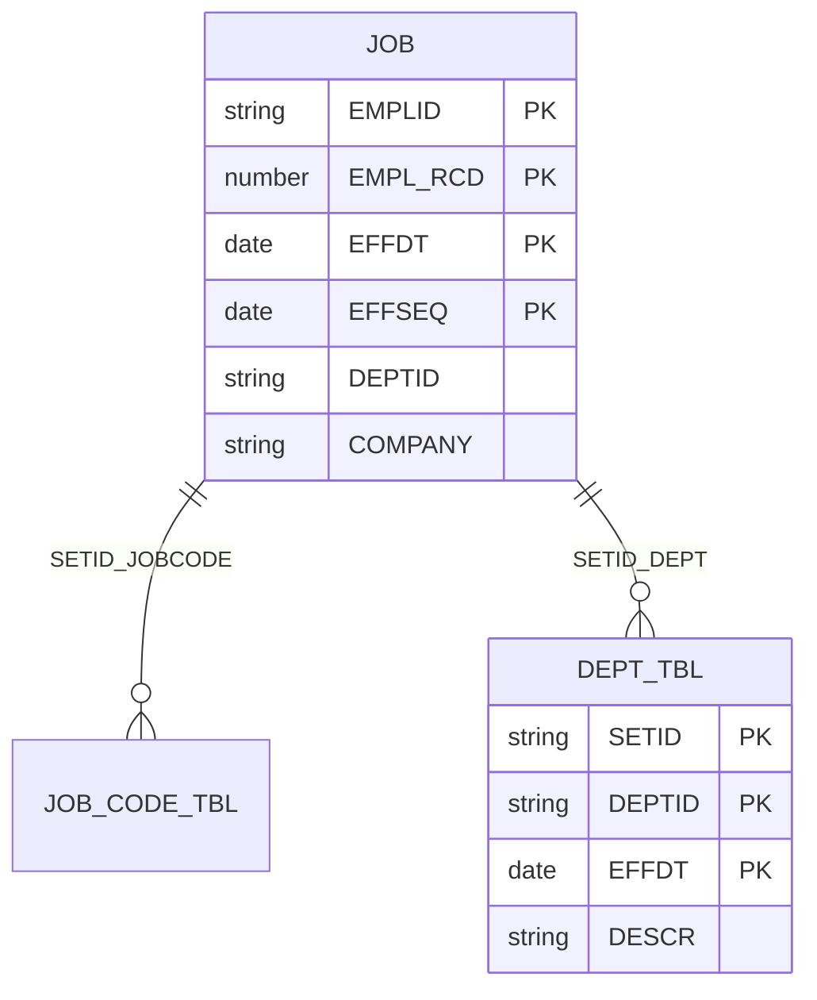
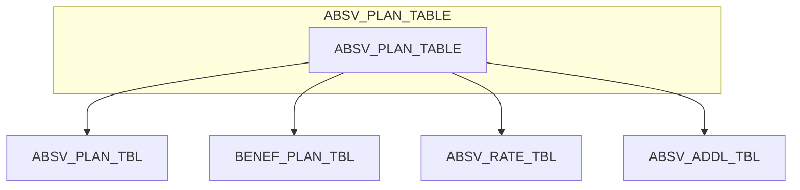
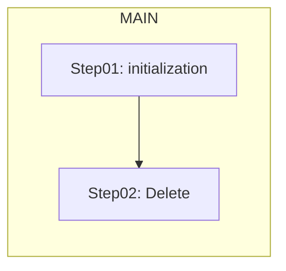
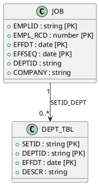
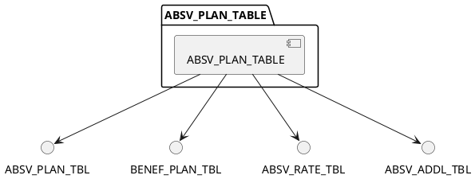

# PeopleTools Diagram Documentation

Generate UML (PlantUML) and Mermaid diagrams from PeopleSoft metadata. Use MCP tools from user-peoplesoft to gather data, then apply the templates below.

## Workflow

1. **Gather metadata** via MCP tools: `get_record_definition`, `get_component_structure`, `get_page_fields`, `get_peoplecode`, `get_application_engine_steps`, `get_table_relationships`, `get_page_field_bindings`, `get_component_pages`.
2. **Choose diagram type** (ERD, component structure, AE flowchart).
3. **Apply template** from this skill or [examples.md](examples.md).
4. **Output** as markdown code block or write to `.md`/`.puml` file.

## Diagram Types

| Type | MCP Data Source | Output |
|------|-----------------|--------|
| Record ERD | get_record_definition, get_table_relationships | Mermaid ER / PlantUML class |
| Component structure | get_component_structure, get_page_fields | Mermaid flowchart / block |
| AE flowchart | get_application_engine_steps | Mermaid flowchart |

---

## Mermaid Templates

### Record ER Diagram

Records as entities; key fields in `{}`; relationships from `get_table_relationships` or shared keys.

### Component Structure (Hierarchy)

Component → pages → records from `get_component_structure` + `get_page_field_bindings` (distinct RECNAME per page).

### Application Engine Flowchart

Steps from `get_application_engine_steps`; use AE_SECTION, AE_STEP, DESCR. Mark PeopleCode vs SQL steps if available (from PSAESTMTDEFN).

---

## PlantUML Templates

### Record Class Diagram

### Component Structure

---

## Conventions

- **Record names:** Use without PS_ prefix (JOB not PS_JOB) for consistency with metadata.
- **Key fields:** Mark with [PK] or place in `{}` for Mermaid ER.
- **Relationships:** Use shared key fields from `get_table_relationships` (relationship_strength, shared_key_fields).
- **Effective-dated:** Add EFFDT, EFFSEQ to key fields when RECTYPE indicates effective-dated table.
- **Scroll levels:** For component pages, OCCURSLEVEL from `get_page_field_bindings` indicates parent/child (0=level 0, 1=scroll 1, etc.).

## MCP Tool Mapping

| Need | Tool |
|------|------|
| Record fields, keys, type | get_record_definition |
| Related records by key | get_table_relationships |
| Component pages | get_component_structure or get_component_pages |
| Records per page | get_page_field_bindings or get_page_fields |
| AE steps, sections | get_application_engine_steps |
| PeopleCode events | get_peoplecode (for class diagram notes) |

## Additional Resources

- [examples.md](examples.md) — Full diagram examples
- [peopletools-mcp skill](../peopletools-mcp/SKILL.md) — MCP tool usage and fallbacks
