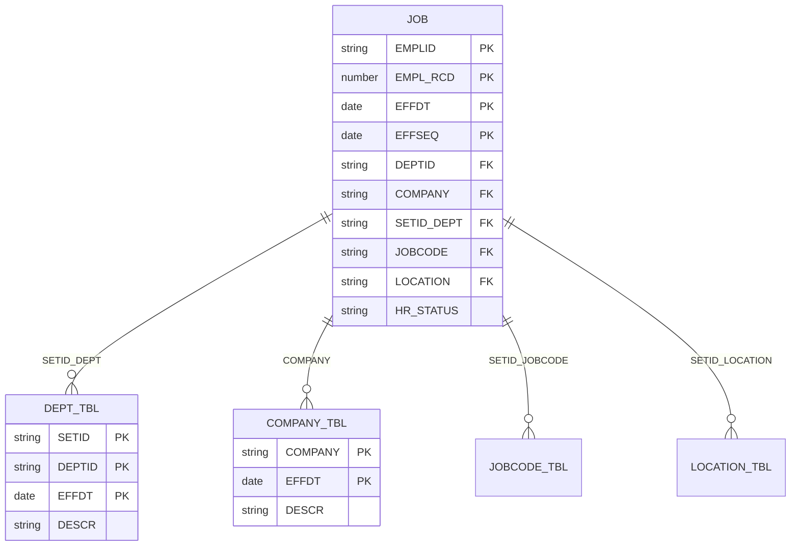
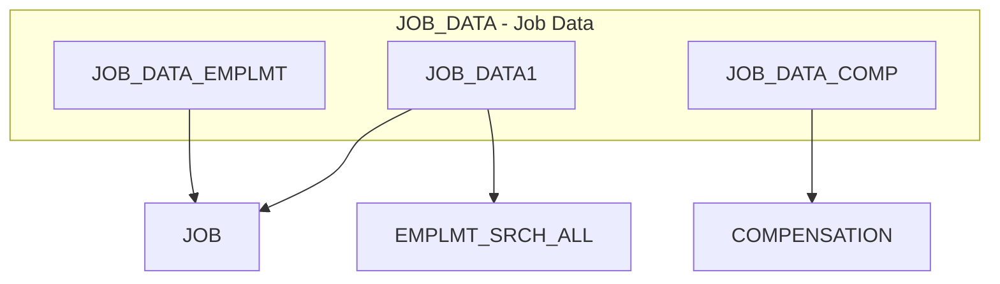
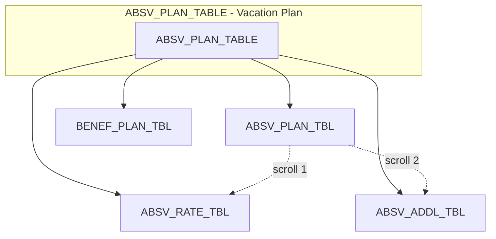
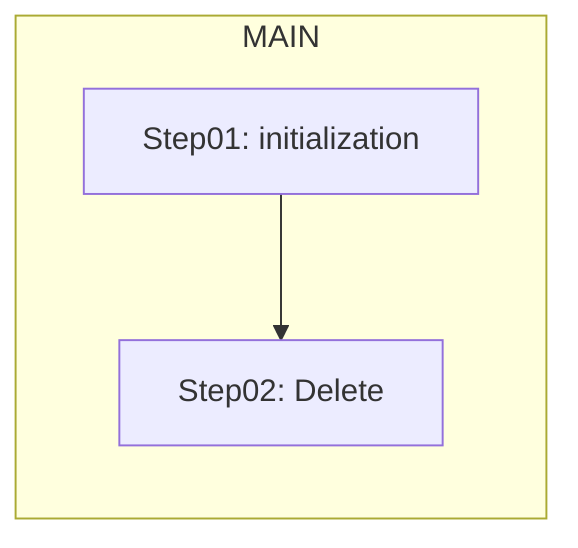
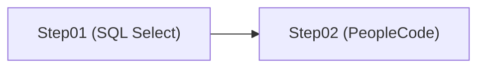
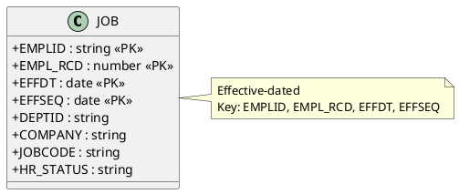
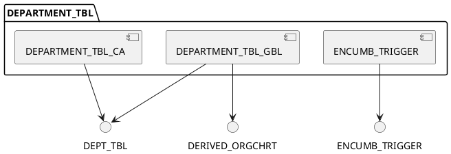
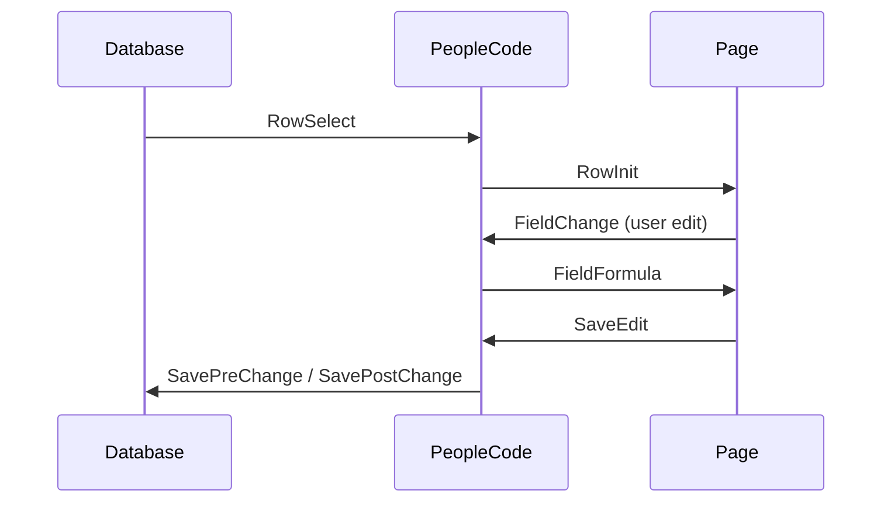

# PeopleTools Diagram Examples

Full examples for each diagram type. Use these as templates when generating from MCP tool output.

---

## 1. Mermaid ER Diagram — JOB and Related Records

From `get_record_definition("JOB")`, `get_table_relationships("JOB")`, `get_record_definition` for related records.

---

## 2. Mermaid Component Structure — JOB_DATA (12 pages)

From `get_component_structure("JOB_DATA")`, `get_page_field_bindings` for each page to get distinct records.

---

## 3. Mermaid Component — Single Page with Scrolls (ABSV_PLAN_TABLE)

From `get_page_field_bindings("ABSV_PLAN_TABLE")` — OCCURSLEVEL indicates scroll (0=main, 1=scroll 1).

---

## 4. Mermaid AE Flowchart — GPES_TAX_10T

From `get_application_engine_steps("GPES_TAX_10T")` — MAIN section, Step01, Step02.

**With PeopleCode vs SQL:**

---

## 5. PlantUML Class — Record with Key Fields

---

## 6. PlantUML Component Package

---

## 7. Mermaid Sequence — PeopleCode Event Flow (Optional)

From `get_peoplecode(record_name)` — show event order (RowInit → FieldChange → SaveEdit).

---

## Tips

- **Truncate large diagrams:** Limit to 5–10 records per ERD; 3–5 pages per component.
- **Focus:** For impact analysis, show only key records and relationships.
- **File output:** Write to `docs/diagrams/<component>_<type>.md` for version control.
